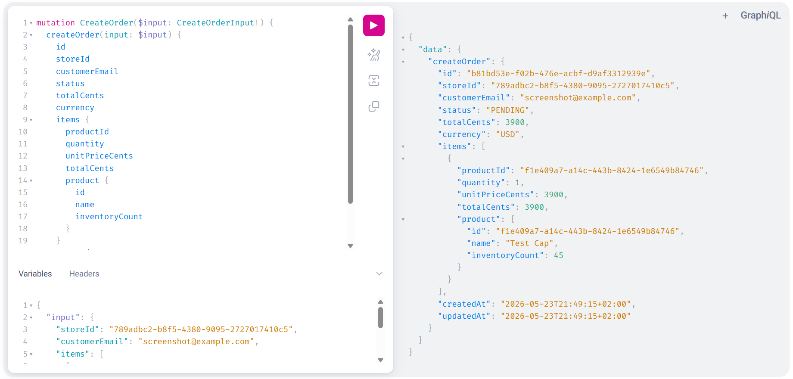

# StoreFlow API

Production-oriented commerce backend built in Go using GraphQL, PostgreSQL and Redis.

StoreFlow demonstrates backend engineering patterns used in real SaaS systems: transactional order processing, JWT authentication, Redis-backed caching with invalidation, store-level authorization, Docker-based development, request IDs, structured JSON logging and clean service boundaries.

## Highlights

- GraphQL API with gqlgen
- PostgreSQL data model for users, stores, products, orders and order items
- Transactional checkout flow with inventory decrement
- Redis product listing cache with TTL and invalidation
- JWT authentication and store ownership authorization
- Docker Compose development environment
- GitHub Actions CI for formatting, tests, migrations and build
- Request IDs and structured JSON HTTP logs
- Graceful HTTP server shutdown

## Architecture

```txt
Client
  ¡
GraphQL API
  ¡
Resolvers
  ¡
Service Layer
  ¡
Repository Interfaces
  ¡
PostgreSQL + Redis
```

## Project Structure

```txt
cmd/api                 Application entrypoint
internal/auth           JWT, password hashing, auth middleware
internal/user           User domain
internal/store          Store domain
internal/product        Product domain + Redis product cache
internal/order          Orders, order items, transactional checkout logic
internal/graphql        gqlgen schema, resolvers and generated code
internal/db             PostgreSQL connection
internal/cache          Redis connection
internal/platform       Logging and HTTP middleware
migrations              SQL migrations
```

## Engineering Decisions

### Integer cents for money

Product and order prices are stored as integer cents instead of floating-point values. This avoids rounding errors and reflects how production commerce systems usually model money.

### Transactional order creation

Creating an order updates multiple pieces of state: `orders`, `order_items` and `products.inventory_count`. This flow runs inside a PostgreSQL transaction so inventory and order data cannot get partially written.

### Historical order prices

Each order item stores `unit_price_cents` at the moment of purchase. Product prices can change later, but old orders preserve the original purchase price.

### Redis cache invalidation

Product listings are cached in Redis with a short TTL. Cache entries are invalidated after product creation and order creation because both operations can change product listing data.

### Store-level authorization

Store owners can manage their own stores, products and orders. Order listing and order status updates require ownership checks.

## Features

### Users

- Register
- Login
- JWT authentication
- Authenticated `me` query
- bcrypt password hashing

### Stores

- Create store
- List stores owned by authenticated user
- Store ownership checks

### Products

- Create products
- Public product listing by store
- Integer-cent price modeling
- Inventory tracking
- Redis product listing cache
- Cache invalidation after writes

### Orders

- Create order
- Order items
- Status tracking: `PENDING`, `PAID`, `SHIPPED`, `CANCELLED`
- Transactional inventory decrement
- Historical unit price capture
- Owner-only order listing
- Owner-only status update

## Local Setup

Start PostgreSQL and Redis:

```powershell
docker compose up -d postgres redis
```

Run database migrations:

```powershell
Get-ChildItem .\migrations\*.up.sql | Sort-Object Name | ForEach-Object {
  Write-Host "Running migration:" $_.Name
  Get-Content $_.FullName | docker exec -i storeflow-postgres psql -v ON_ERROR_STOP=1 -U storeflow -d storeflow
}
```

Run the API:

```powershell
go run .\cmd\api\main.go
```

Health check:

```powershell
curl.exe -i http://localhost:8080/health
```

Expected response:

```txt
HTTP/1.1 200 OK
X-Request-ID: <request-id>

OK
```

GraphQL endpoint:

```txt
http://localhost:8080/graphql
```

GraphQL Playground:

```txt
http://localhost:8080/playground
```

## GraphQL Playground

Example `createOrder` mutation running locally:



## Example GraphQL Operations

### Register

```graphql
mutation Register($input: RegisterInput!) {
  register(input: $input) {
    token
    user {
      id
      email
      name
      createdAt
      updatedAt
    }
  }
}
```

Variables:

```json
{
  "input": {
    "email": "jan@example.com",
    "password": "Password123!",
    "name": "Jan Test"
  }
}
```

### Create Order

```graphql
mutation CreateOrder($input: CreateOrderInput!) {
  createOrder(input: $input) {
    id
    storeId
    customerEmail
    status
    totalCents
    currency
    items {
      productId
      quantity
      unitPriceCents
      totalCents
      product {
        id
        name
        inventoryCount
      }
    }
    createdAt
    updatedAt
  }
}
```

Variables:

```json
{
  "input": {
    "storeId": "STORE_ID",
    "customerEmail": "customer@example.com",
    "items": [
      {
        "productId": "PRODUCT_ID",
        "quantity": 2
      }
    ]
  }
}
```

## Redis Cache

Product listings use this Redis key format:

```txt
store:{storeId}:products:active:{true|false}
```

Example:

```txt
store:789adbc2-b8f5-4380-9095-2727017410c5:products:active:true
```

Cache behavior:

- 60-second TTL
- invalidated after product creation
- invalidated after order creation because inventory changes

## CI

GitHub Actions validates the project on push and pull request.

The CI workflow runs:

- Go dependency download
- `gofmt` check
- `go test ./...`
- SQL migrations against PostgreSQL
- API build

## Deployment Story

The project currently runs locally with Docker Compose and is validated through GitHub Actions CI.

Production-oriented pieces already included:

- Dockerfile
- Docker Compose
- SQL migrations
- environment-based config
- graceful HTTP shutdown
- request IDs
- structured JSON logs
- CI pipeline

A production deployment would typically run the API as a containerized service behind a load balancer, using managed PostgreSQL and Redis.

Not included yet:

- Kubernetes manifests
- Terraform
- production secrets management
- metrics and alerting
- distributed tracing

## Tests

Run all tests:

```powershell
go test ./...
```

Current test coverage includes:

- password hashing
- password verification
- JWT generation and validation
- product cache key behavior
- order status validation
- order service validation for invalid inputs

## Current Limitations

Not implemented:

- payments
- Stripe integration
- refunds
- shipping
- tax calculation
- pagination
- dataloaders
- role-based access control
- production deployment manifests

## Next Improvements

- Add pagination for products and orders
- Add integration tests with PostgreSQL
- Add GraphQL dataloaders
- Add metrics and alerting
- Add rate limiting